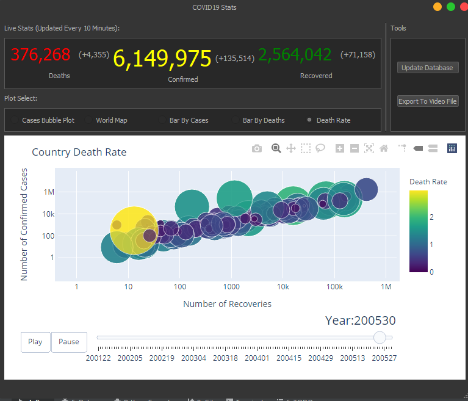

## COVID-19 Stats Visualizer

The program visualizes The Latest COVID-19 data through multiple different graphs, we will give you a quick recap of it's main features. 

 

This is the main window of our program, it displays the latest COVID-19 numbers at the top, the program uses various an online API to update these stats, which are gathered from multiple official sources, every 10 minutes provided that an internet connection is available, the total number of Cases, Deaths & Recoveries are written with today's addition marked besides it in brackets. A status bar exists at the bottom indicating the current status of the app, a log is also created 
The image also shows an animated interactive bubble plot, where the bubble's size indicates new cases at the given date.   
 
This image shows an interactive world map.   
  
 Clicking on a country opens a browser window showing a plot of this country's Cases & Deaths over time.   
   
An image of the resulting plot.   
  
 Bar Chart of Cases.   
  
 Bar Chart of Deaths.   
  
 This bubble graph contains the accumulated data of each country, where the bubble's size indicates the Death Rate.   
  
 Clicking on Update Database updates the programs database, getting the latest data available from various APIs, saving them & regenerates the Graphs, in case the program fails to connect to the APIs, the old data is retained & it only regenerates the graphs, the status bar shows the currently running action, during this process the app is still usable but in view-only mode, as the database is locked, you can only view the graphs, but exporting to video is disabled till the process is complete.   
  
The Update Has Finished 
 
Clicking on the export button exports the currently selected graph, this process might take a few minutes, as usual the progress will be shown in the status bar, during this process the program is again in the view-only mode and the database is locked  
 
Rendering is in progress.   
 
Rendering Complete, choose where to save your video.  
 
Or Not.  
  
Saving Complete! Thank you for your time and for viewing our app.
